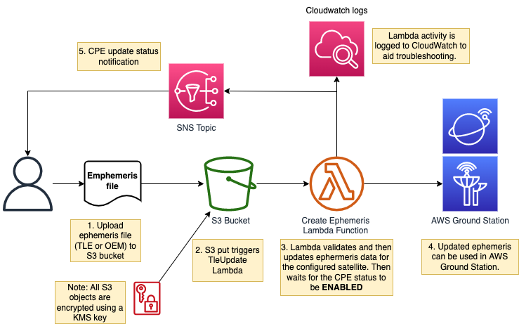

# Using customer provided ephemeris (CPE) with AWS Ground Station

This guide deploys a pipeline that uses AWS Ground Station Customer Provided Ephemeris (CPE) to update antenna pointing instructions within the service. 
CPE allows customers to provide their own orbital parameters, rather than AWS Ground Station obtaining the information automatically, 
this is especially useful during LEOP when ephemeris data is not yet available from NORAD and for craft that are not tracked by NORAD. 

Please refer to the [AWS Ground Station API](https://boto3.amazonaws.com/v1/documentation/api/latest/reference/services/groundstation.html) guide for additional information on how the CPE API works.

# Solution diagram



# Pre-requisites

This guide use the JPSS-1 craft as an example, so you must have it on boarded into your AWS account. Alternatively, you can use your own craft by setting the "SatelliteName" parameter in the CloudFormation template to your craft name. 

To get JPSS-1 onboarded to your account for the CPE public beta send an email to aws-groundstation@amazon.com with the following details:
- Satellite NORAD ID: 43013 (JPSS-1)
- You AWS Account Id
- AWS Regions you want use the Ground Station Service
- AWS Regions you want to downlink the data to, normally the same as above
- Request CPE public beta access for JPSS-1


# Deployment 

Create a CloudFormation stack using the template: CPE-updater.yml. [Learn how to create a CloudFormation stack](https://docs.aws.amazon.com/AWSCloudFormation/latest/UserGuide/cfn-console-create-stack.html). On the [stack creation console](https://console.aws.amazon.com/cloudformation) click Create Stack -> With New Resource. Then select the "Template is ready" radio button and "Upload a template file" radio button. Upload the CPE-updater.yml file here. 

Enter parameters as follows in the CloudFormation console and then deploy the stack:

- SatelliteName: Name of the satellite, for which you will be updating ephemeris.  ("JPSS-1" for this example)
- NoradId: NoradId of the satellite, for which you will be updating ephemeris.  ("43013" for this example)
- TleExpiration: Number of days that the ephemeris will be valid.  (Keep the default for this example)
- NotificationEmail: Email address to receive ephemeris update status.


# Updating TLEs for a satellite

Create a file named `some_satellite-tle.txt` (replacing `some_satellite` with your satellite name). 

Using JPSS-1 as an example:
1. Use the command below to push the latest JPSS-1 TLE data into a file named JPSS-1-tle.txt

```bash
curl https://celestrak.org/NORAD/elements/gp.php\?CATNR\=43013 -o JPSS-1-tle.txt
```

2. Get the name of the S3 bucket bucket, where you need to upload the TLE file from the Outputs section of the CloudFormation template that you deployed. It should have the following format: `<AWS-account-ID>-config-bucket-<aws-region>`. 

3. Create a folder names `configs` in the above S3 bucket and upload the `JPSS-1-tle.txt` file there. The file should be uploaded to `/configs/JPSS-1-tle.txt`. This triggers a lambda function that uses the CPE API to update the ephemeris for the selected craft.

4. Check your email for the CPE status change notification. 

5. Confirm the TLE update was successful by following the steps below:

- Check the S3 bucket for the object `/configs/JPSS-1-tle.txt.json`. It should look similar to the file below.

```json
[
  {
    "tleLine1": "1 43013U 17073A   22282.83113825  .00000130  00000+0  82297-4 0  9991",
    "tleLine2": "2 43013  98.7234 219.6245 0001638  86.5638 273.5725 14.19549015253458",
    "validTimeRange": {
      "startTime": "2022-08-03T13:01:09.888148",
      "endTime": "2022-08-10T13:01:09.888157"
    }
  }
]
```

- Check that the TLE Update Lambda function `<CFN-stack-name>-CpeUpdateLambda-<randomstring>` ran OK. The easiest way is to check CloudWatch logs (the log group will be named the same as the Lambda function). You should see `VALIDATING`, then `ENABLED` to indicate that the TLE file was valid and successfully updated for the specified satellite. If you see `VALIDATING`, then `INVALID`, the TLE file was incorrect for some reason. If you get an `INVALID` state check the line after `Done polling` print in the CloudWatch logs. This long json line is a print out of the DescribeEphemeris API call. Look for the `invalidReason` field in that line. The field will tell you more about the issue. These are the possible states:

        METADATA_INVALID - Provided spacecraft identifiers such as satellite ID are invalid

        TIME_RANGE_INVALID - Start, end, or expiration time(s) are invalid for the provided ephemeris

        TRAJECTORY_INVALID - Provided ephemeris defines an invalid spacecraft trajectory

        VALIDATION_ERROR - Internal service error occurred while processing ephemeris for validation


# Updating OEMs for a satellite

Save your OEM file as `some_satellite.oem` (replacing `some_satellite` with your satellite name). 

Using JPSS-1 as an example:

1. Download an OEM file:

- Go to https://fieldterminal.nesdis.noaa.gov and login to the account. Once logged in you will see a navigation bar to the left of the screen:
  - Click on the **Data** tab under the *Repository* section
  - Select **Auxiliary** from the *Data category* dropdown
  - Select **CGS** as the *Data source*
  - Select **ephemeris_data** as the *data type*
  - Now select **J01** (JPSS)
  - Select the latest OEM file from the list and hit **Download**

2. Rename the downloaded OEM file to `JPSS-1.oem`. 

3. Get the name of the S3 bucket bucket, where you need to upload the OEM file from the Outputs section of the CloudFormation template that you deployed. It should have the following format: `<AWS-account-ID>-config-bucket-<aws-region>`. 

4. Create a folder named `configs` in the above S3 bucket and upload the `JPSS-1.oem` file there. The file should be uploaded to `/configs/JPSS-1.oem`. This triggers a lambda function that uses the CPE API to update the ephemeris for the selected craft.

5. Check your email for the CPE status change notification. 

6. Confirm the OEM update was successful by checking that the CPE Update Lambda function `<CFN-stack-name>-CpeUpdateLambda-<randomstring>` ran OK. The easiest way is to check CloudWatch logs (the log group will be named the same as the Lambda function). You should see `VALIDATING`, then `ENABLED` to indicate that the OEM file was valid and successfully updated for the specified satellite. If you see `VALIDATING`, then `INVALID`, the OEM file was incorrect for some reason. Check the section above on TLE updates for more information for the `INVALID` status. 


