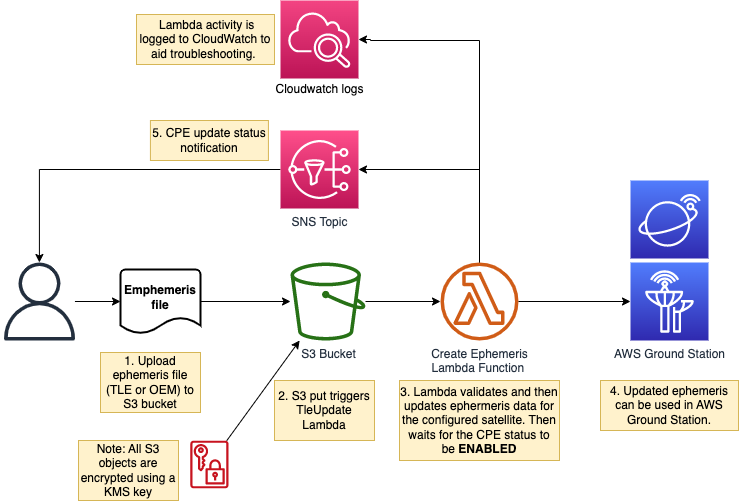

# Using customer provided ephemeris (CPE) with AWS Ground Station

This guide deploys a pipeline that uses AWS Ground Station Customer Provided Ephemeris (CPE) to update antenna pointing instructions within the service. 
CPE allows customers to provide their own orbital parameters, rather than AWS Ground Station obtaining the information automatically, 
this is especially useful during LEOP when ephemeris data is not yet available from NORAD and for craft that are not tracked by NORAD. 

There is also an option section at the end of this document to deploy a lambda function, which will automatically reschedule any contacts several days into the future for the satellite to ensure the updated orbital parameters are used.

Please refer to the [AWS Ground Station API](https://boto3.amazonaws.com/v1/documentation/api/latest/reference/services/groundstation.html) guide for additional information on how the CPE API works.

## Solution diagram



## Pre-requisites

This guide uses the JPSS-1 craft as an example, so you must have that satellite on-boarded into your AWS account. Alternatively, you can use your own craft by setting the "SatelliteName" parameter in the CloudFormation template to your craft name. 

To get JPSS-1 onboarded to your account for the CPE public beta send an email to aws-groundstation@amazon.com with the following details:
- Satellite NORAD ID: 43013 (JPSS-1)
- You AWS Account Id
- AWS Regions you want use the Ground Station Service
- AWS Regions you want to downlink the data to, normally the same as above


## Deployment 

Create a CloudFormation stack using the template: CPE-updater.yml. [Learn how to create a CloudFormation stack](https://docs.aws.amazon.com/AWSCloudFormation/latest/UserGuide/cfn-console-create-stack.html). On the [stack creation console](https://console.aws.amazon.com/cloudformation) click Create Stack -> With New Resource. Then select the "Template is ready" radio button and "Upload a template file" radio button. Upload the CPE-updater.yml file here. 

Enter parameters as follows in the CloudFormation console and then deploy the stack:

- SatelliteName: Name of the satellite, for which you will be updating ephemeris.  ("JPSS-1" for this example)
- NoradId: NoradId of the satellite, for which you will be updating ephemeris.  ("43013" for this example)
- TleExpiration: Number of days that the ephemeris will be valid.  (Keep the default for this example)
- NotificationEmail: Email address to receive ephemeris update status.
- SatelliteId: (Optional) The satellite-id (use `aws groundstation list-satellites` to obtain the satellite ID)

Note, if the SatelliteId parameter is left blank the NORAD ID will be used.

## Updating TLEs for a satellite

1. Create a file named `SatelliteName-tle.txt` (replacing `SatelliteName` with the value used for the `SatelliteName` CloudFormation parameter).

If you are using JPSS-1 the command below will obtain the latest JPSS-1 TLE data from Celestrak into a file named JPSS-1-tle.txt

```bash
curl https://celestrak.org/NORAD/elements/gp.php\?CATNR\=43013 -o JPSS-1-tle.txt
```

2. Get the name of the S3 bucket, where you need to upload the TLE file from the Outputs section of the CloudFormation template that you deployed. It will have the following format: `<AWS-account-ID>-config-bucket-<SatelliteName>-<aws-region>`. 

3. Create a folder named `configs` in the above S3 bucket and upload the `SatelliteName-tle.txt` file there. The file should be uploaded to `/configs/SatelliteName-tle.txt`. Uploading the file to S3 triggers a lambda function that uses the CPE API to update the ephemeris for the selected satellite.

4. Once the Lambda function has finished, you should receive an email containing the result of CPE status change.

5. Confirm the TLE update was successful by following the steps below:

- Check the S3 bucket for the object `/configs/SatelliteName-tle.txt.json`. It should look similar to the file below.

```json
[
  {
    "tleLine1": "1 43013U 17073A   22282.83113825  .00000130  00000+0  82297-4 0  9991",
    "tleLine2": "2 43013  98.7234 219.6245 0001638  86.5638 273.5725 14.19549015253458",
    "validTimeRange": {
      "startTime": "2022-08-03T13:01:09.888148",
      "endTime": "2022-08-10T13:01:09.888157"
    }
  }
]
```

- Check that the TLE Update Lambda function `<CFN-stack-name>-CpeUpdateLambda-<randomstring>` ran OK. The easiest way is to check CloudWatch logs (the log group will be named the same as the Lambda function). You should see `VALIDATING`, then `ENABLED` to indicate that the TLE file was valid and successfully updated for the specified satellite. If you see `VALIDATING`, then `INVALID`, the TLE file was incorrect for some reason. If you get an `INVALID` state check the line after `Done polling` print in the CloudWatch logs. This long json line is a print out of the DescribeEphemeris API call. Look for the `invalidReason` field in that line. The field will tell you more about the issue. These are the possible states:

        METADATA_INVALID - Provided spacecraft identifiers such as satellite ID are invalid

        TIME_RANGE_INVALID - Start, end, or expiration time(s) are invalid for the provided ephemeris

        TRAJECTORY_INVALID - Provided ephemeris defines an invalid spacecraft trajectory

        VALIDATION_ERROR - Internal service error occurred while processing ephemeris for validation


## Updating OEMs for a satellite

Save your OEM file as `some_satellite.oem` (replacing `some_satellite` with your satellite name). 

Using JPSS-1 as an example:

1. Download an OEM file:

- Go to https://fieldterminal.nesdis.noaa.gov and login to the account. Once logged in you will see a navigation bar to the left of the screen:
  - Click on the **Data** tab under the *Repository* section
  - Select **Auxiliary** from the *Data category* dropdown
  - Select **CGS** as the *Data source*
  - Select **ephemeris_data** as the *data type*
  - Now select **J01** (JPSS)
  - Select the latest OEM file from the list and hit **Download**

2. Rename the downloaded OEM file to `JPSS-1.oem`. 

3. Get the name of the S3 bucket bucket, where you need to upload the OEM file from the Outputs section of the CloudFormation template that you deployed. It should have the following format: `<AWS-account-ID>-config-bucket-<aws-region>`. 

4. Create a folder named `configs` in the above S3 bucket and upload the `JPSS-1.oem` file there. The file should be uploaded to `/configs/JPSS-1.oem`. This triggers a lambda function that uses the CPE API to update the ephemeris for the selected craft.

5. Check your email for the CPE status change notification. 

6. Confirm the OEM update was successful by checking that the CPE Update Lambda function `<CFN-stack-name>-CpeUpdateLambda-<randomstring>` ran OK. The easiest way is to check CloudWatch logs (the log group will be named the same as the Lambda function). You should see `VALIDATING`, then `ENABLED` to indicate that the OEM file was valid and successfully updated for the specified satellite. If you see `VALIDATING`, then `INVALID`, the OEM file was incorrect for some reason. Check the section above on TLE updates for more information for the `INVALID` status. 


## Obtaining the Ephemeris in-use by a satellite

The active Ephemeris used by a satellite can be obtained using the AWS CLI.
The process below obtains the TLE in used by a satellite.

1. List all the satellites for this AWS account in a required AWS region:

`aws groundstation list-satellites --region <aws-region>`

2. Copy the satellite-id from the previous command and use it in the next command to obtain the Ephemeris id for the satellite:

`aws groundstation get-satellite --satellite-id <satellite-id> --region <aws-region>`

3. Copy the ephemeris-id from the previous command and use it in the next command to obtain Ephemeris info:

`aws groundstation describe-ephemeris --ephemeris-id <ephemeris-id>`

4. Download the ephemeris file using the (bucket and key parameters from the previous command)

`aws s3 cp s3://<buckeet>/<key> .`

5. Display the ephemeris info (Using the key parameter from the previous command)

Windows: `type <key>`
Linux: `cat <key>`


## Configure AWS Ground Station to use the TLEs automaitcally provided by the AWS Ground Station Service

When a satellite has been allocated a NORAD ID, the AWS Ground Station service will automatically obtain and configure the Ephemeris for a satellite, unless there is an active customer-provided emphemeris. Thus, if you would like the AWS Ground Station service to manage the Ephemeris you can either allow a customer-provided emphemeris to expire, or manually delete it.

To check the expiration date of TLE data, check the `endTime` parameter in the json file obtained using the previously described `Obtaining the Ephemeris in-use by a satellite` process.

To manually delete a customer-provided emphemeris use the process below:

1. List all the satellites for this AWS account in a required AWS region:

`aws groundstation list-satellites --region <aws-region>`

2. Copy the satellite-id from the previous command and use it in the next command to obtain the Ephemeris id for the satellite:

`aws groundstation get-satellite --satellite-id <satellite-id> --region <aws-region>`

3. Copy the ephemeris-id from the previous command and use it in the next command to delete the customer-provided-ephemeris :

`aws groundstation delete-ephemeris --ephemeris-id <ephemeris-id> --region <aws-region>`


# Automatic contact rescheduling after ephemeris update 

This optional section creates a Lambda function that is triggered when a CPE entry is updated and goes into the `ENABLED` state. The function cancels all passes scheduled within the next 6 days with a provided mission profile and satellite, whose CPE you have updated. Then it reschedules the closest possible passes using the updated CPE. This corresponds to steps 6 to 8 of the extended high level solution diagram shown below.

If you choose to deploy the optional automatic rescheduler part you will need a AWS Ground Station mission profile. For the JPSS-1 example you can create a mission profile by following the guide here: https://aws.amazon.com/blogs/publicsector/automated-earth-observation-aws-ground-station-amazon-s3-data-delivery/. If you're using your own satellite make sure you have a deployed mission profile for it. 


## CloudFormation deployment 

You **must** deploy the this CloudFormation stack in the same AWS region as the mission profile you are using. This is because AWS Ground Station mission profiles are regional constructs. 

Continuing with the JPSS-1 example:

Create a CloudFormation stack using the template: rescheduler.yml. [Learn how to create a CloudFormation stack](https://docs.aws.amazon.com/AWSCloudFormation/latest/UserGuide/cfn-console-create-stack.html). On the [stack creation console](https://console.aws.amazon.com/cloudformation) click Create Stack -> With New Resource. Then select the "Template is ready" radio button and "Upload a template file" radio button. Upload the rescheduler.yml file here. 

Enter parameters as follows in the CloudFormation console and then deploy the stack:

- MissionProfileName: The name of the AWS Ground Station Mission Profile for the satellite using CPE. (For the JPSS-1 example use the mission profile you deployed using the S3 data delivery blog)
- NotificationEmail: "Email address to receive contact rescheduling updates"


## Auto-rescheduler post-implementation test plan

1. Using the same mission profile, schedule 2 contacts with the satellite, whose CPE you're updating (e.g. JPSS-1 NORAD ID: 43013) and 1 contact with another satellite (e.g. AQUA NORAD ID: 27424). 
2. Update the ephemeris of JPSS-1 using either the TLE or OEM method. 
3. Confirm the CpeUpdateLambda was successful (using the steps above). 
4. Confirm the GroundStationCloudWatchEventHandlerLambda Lambda worked correctly (part of the Rescheduler CFN stack). Do this by checking its CloudWatch logs. 
5. Check your email for an SNS notification. Only the 2 contacts scheduled with the CPE updated satellite should have been rescheduled. The other contact should **not** have been canceled and rescheduled.

